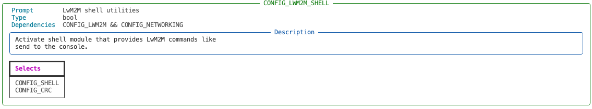
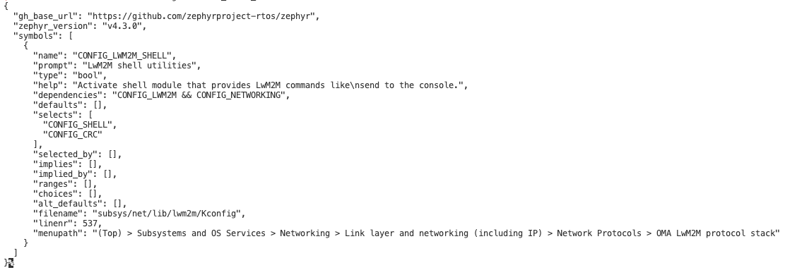

# Zephyr KConfig

Various tools/helpers/cli to assist with Zephyr's KConfig

## Run / Install

### Run via `uvx`

```bash
# always fetches the latest version
uvx --from zepyhr-kconfig --help
```

### Install as `uv` as tool

```bash
# installs the current version
uv tool install zephyr-kconfig
```

Above also install `zkc` cli (also accessible via `zephyr-kconfig` if you have conflict with `zkc`)

```bash
# examples - (zkc is an alias to zephyr-kconfig)
zkc --help
zephyr-kconfig --help
```

## Add to your project

```bash
uv add zephyr-kconfig --dev
```

and then run the cli via

```bash
uv run zkc --help
```

## Features

Below examples are assuming you are running the tool globally

> Note - uvx does sandboxing (virtualenv) for you so no need to worry

```bash
# show the description of CONFIG_LWM2M_SHELL
uvx zepyhr-kconfig --release 4.3.0 describe CONFIG_LWM2M_SHELL
```




```bash
# get the description as JSON output for CONFIG_LWM2M_SHELL
uvx zepyhr-kconfig --release 4.3.0 describe CONFIG_LWM2M_SHELL
```



> A partial CONFIG spec will get all items that start with the provided inpu for
  example CONFIG_LWM2M_ will output all L2M2M config items
